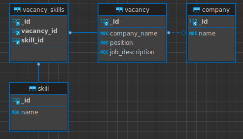

# Домашняя работа № 2. Python для сетевого программирования

## Установка
* docker-compose up 
* pip install pipenv
* pipenv install

## Запуск
* pipenv shell
* python main.py

## Проверка оформления кода
* flake8

## Диаграмма базы данных

